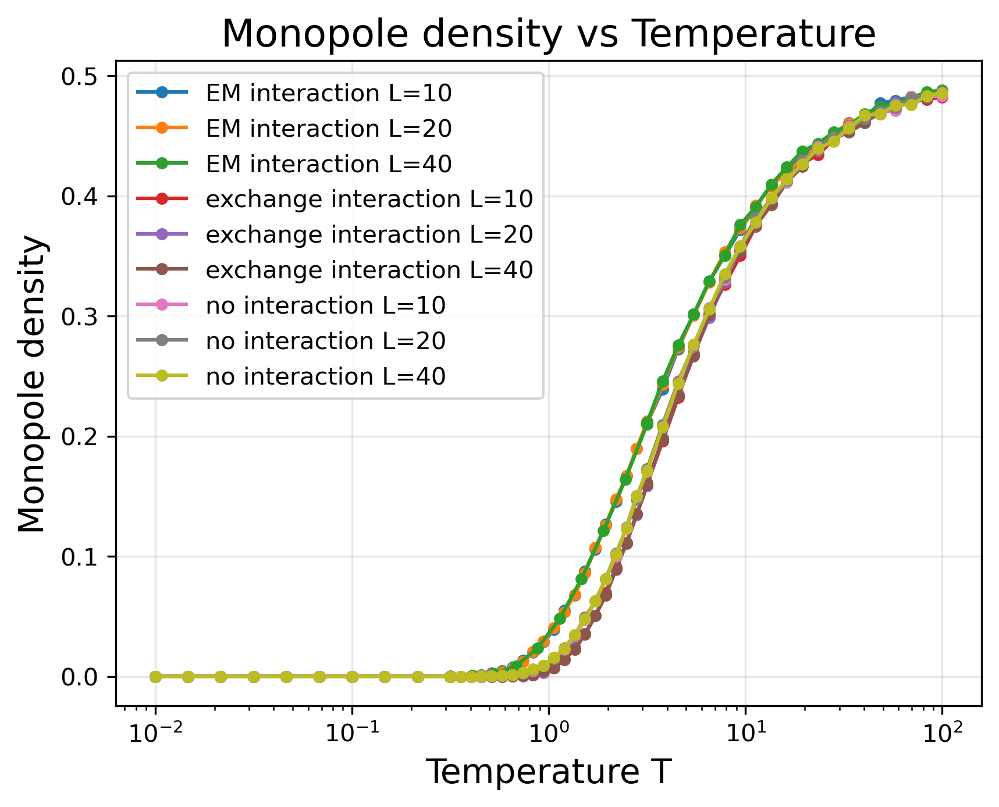
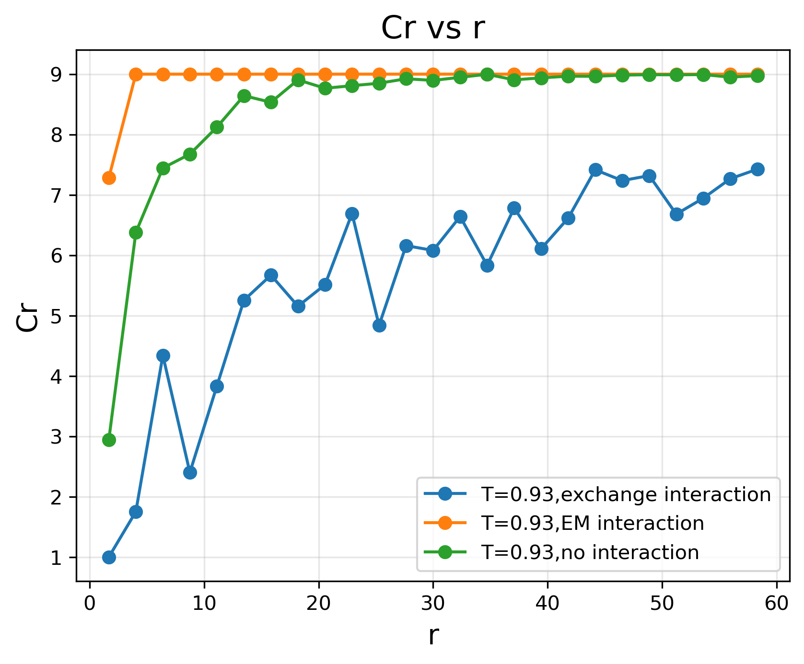

这是一份蒙特卡洛模拟蜂窝状自旋冰的code，在文件夹中有两份代码，一份是simulation.py，一份是plot.py。

前者负责模拟并且将结果输出到outpot/中的各个文件夹中，其中包括snapshot：晶格中所有的自旋的构型。result：宏观量，能量，比热等对温度的关系。correlation：磁偶极关联函数。

后者负责读取这些结果并且画图，画出的图自动保存到images/的文件夹中

模拟的各个模块可以分开加入，比如可以进行只热化不测量的模拟，只测量宏观量不测量关联函数的模拟，对应的flag可以自行指定，需要注意这些部分中耗时最长的是磁偶极关联函数的测量。

程序的核心想法是先将蜂窝状自旋冰映射到二维矩阵上，初始化。随后再使用标准蒙特卡洛热化退火测量。我采用了一个有效哈密顿量。关于我模拟的假设可以见我的ppt模拟方法的一页。

模拟的结果上，我取了三种不同的相互作用势能。首先可以观察到低温下趋近于有序的交换作用势会抑制磁单极产生，低温下无序的电磁相互作用势会促进磁单极产生，无相互作用的情形介于两者之间。

我更进一步地研究了磁偶极关联函数，以期望得到磁单极准粒子之间的相互作用形式。但是我没有得到我期望的结果，但是我看到了磁偶极之间的排斥相互作用

这种排斥即使对于无相互作用的自旋冰也存在，我推测这是蜂窝状结构的拓扑学结构导致的熵主导的磁单极之间的排斥相互作用。这能够证明蜂窝状自旋冰在低温下能够支持等效的磁单极子的激发。

初次之外，我的工作中另一个核心工作是可视化的实现，这部分的程序可以在plot.py中找到，虽然我没有保存这些图，画出的图可以在展示ppt中见到。