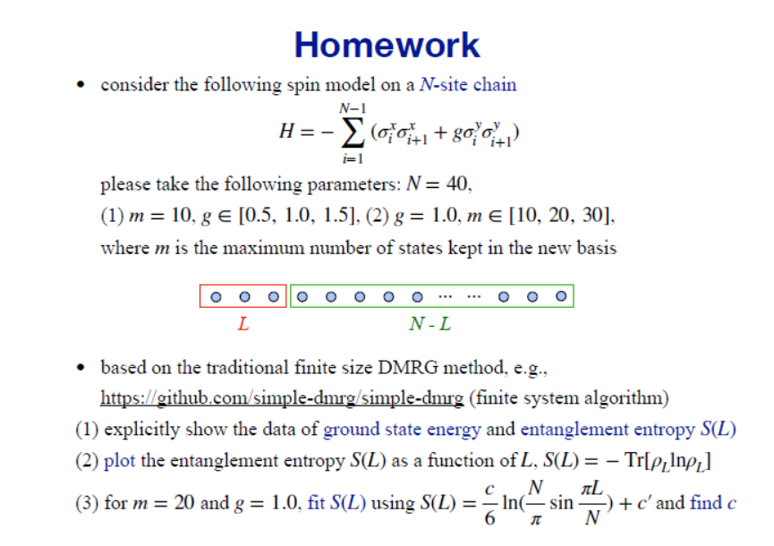
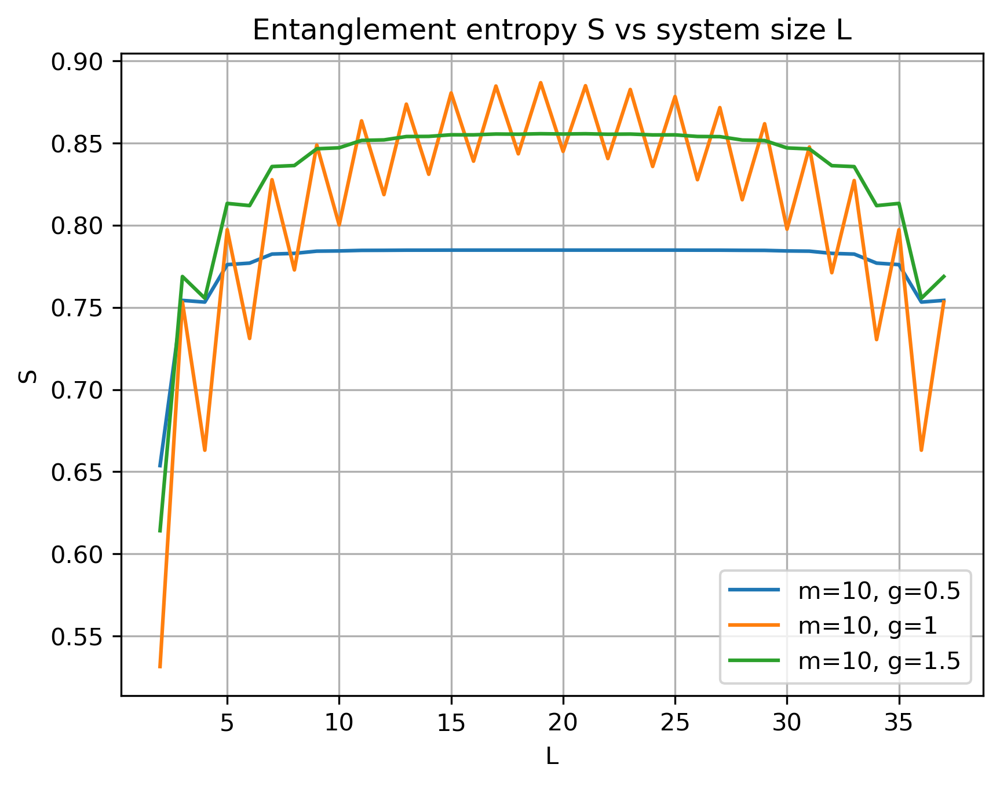
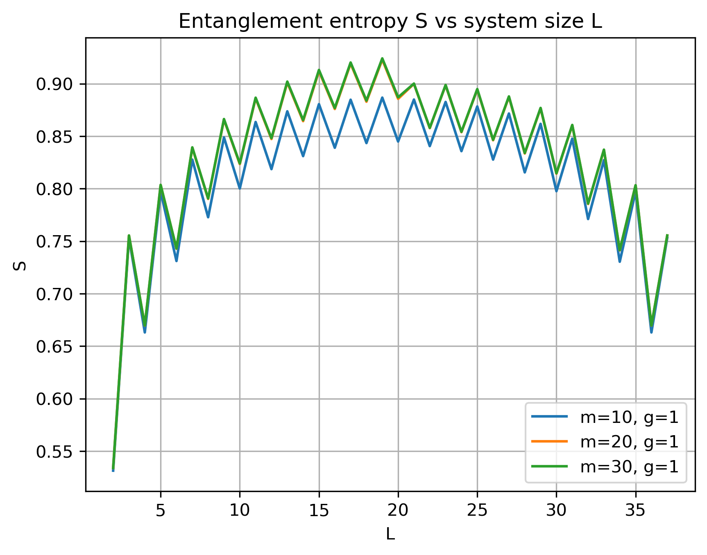
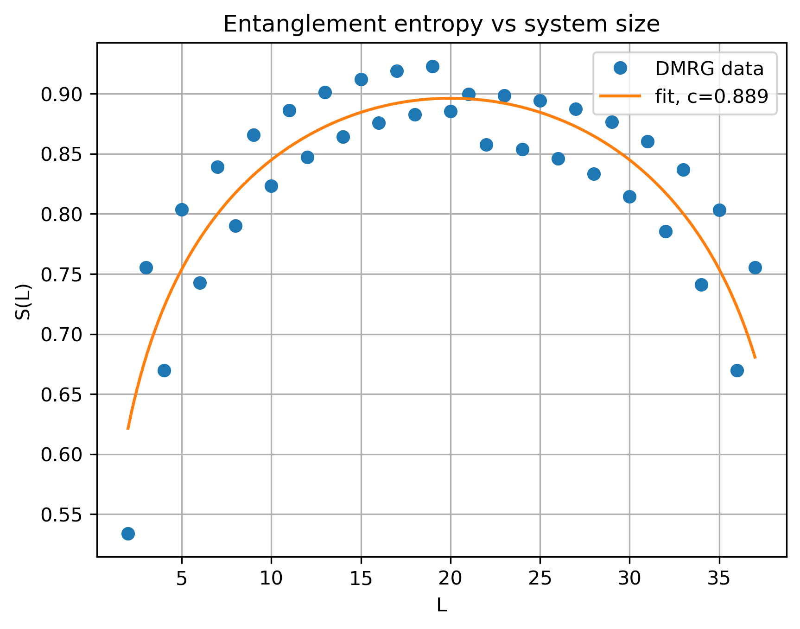

这次作业文件夹中有两个python脚本

DMRG.py是主程序

simple_dmrg_02_finite_system.py是所使用的函数库

其中simple_dmrg_02_finite_system.py修改自https://github.com/simple-dmrg/simple-dmrg/，我所做的修改主要是更改了二体哈密顿量，加入了耦合常数g，同时修改了输出逻辑使得纠缠熵的计算更加方便。我在函数中的修改均有#zhujie式样的注释，可以搜索“zhujie”来了解我具体在哪里做了修改。如果这不符合学术规范，请告知我，我将修改我在其中使用的函数。

可以在命令行中使用

python3 DMRG.py

运行主程序，一段时间后，满足作业要求的数值会输出到命令行里并且图片会保存在/images中。

我使用的核心函数finite_system_algorithm主要进行了一下几步以得到基态波函数：

1.利用infinite_algorithm进行warmup，生成一个较为接近基态的迭代初始态。

2.将总系统的一部分作为系统，另一部分作为环境，依据纠缠进行阶段，反复sweep得到优化的基态。

在这次作业中我遇到的最大的问题是理解算法的逻辑。
最后作图结果可以见
(1)
(2)
fit的结果我也作了图，可以直观地看到fit的结果：
