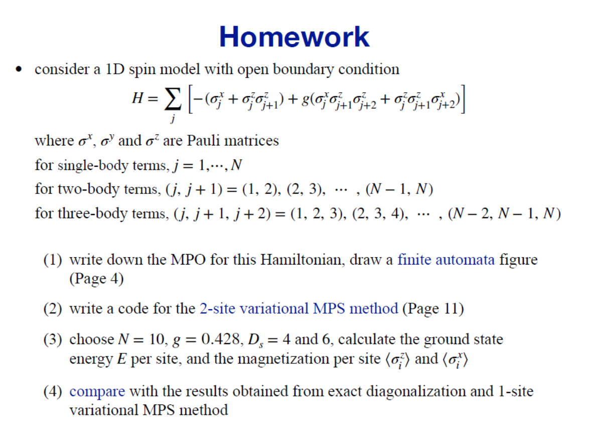
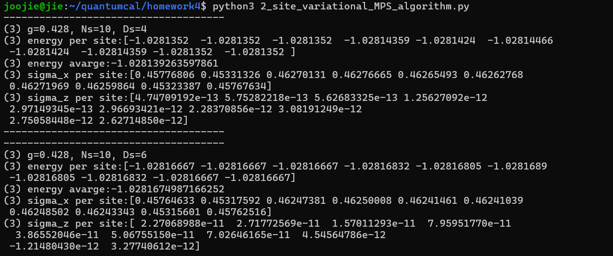
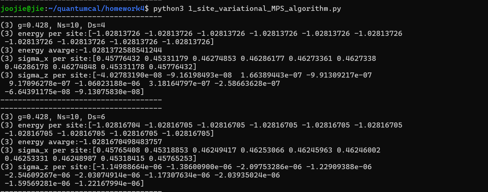
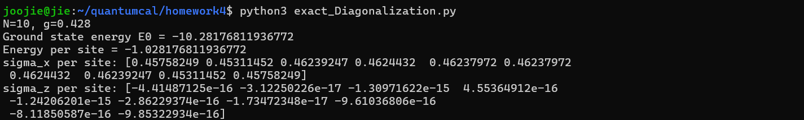
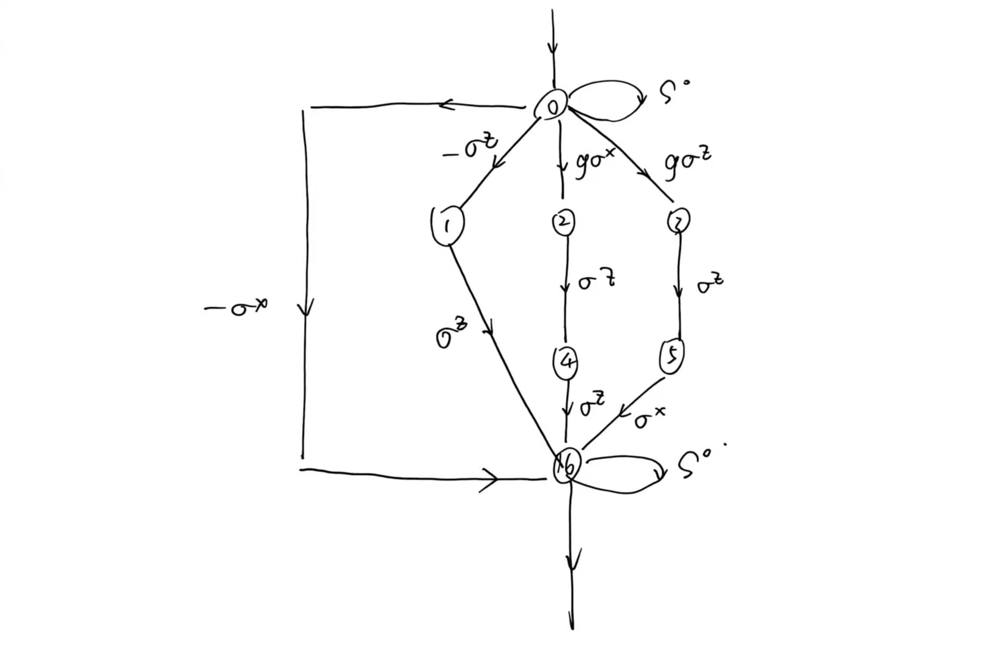

在这次作业中，我主要参考了杨老师上传在网络学堂上的1-site的代码和其中使用的库，我的代码在构造初始条件的步骤没有创新，并且使用了杨老师使用的svd函数和缩并函数，这些支持函数在Sub.py中，如果使用这些库不符合作业要求，请告知我，我会立即修改并且使用我本人编写的函数。

文件中除了此说明文档包含了四个python脚本
2_site_variational_MPS_algorithm.py
1_site_variational_MPS_algorithm.py
exact_Diagonalization.py
Sub.py
其中2_site_variational_MPS_algorithm.py, 1_site_variational_MPS_algorithm.py 需要和Sub.py在同一个文件夹下才能运行
前三个脚本可以通过 python3 2_site_variational_MPS_algorithm.py运行并且在命令行中打印符合输出格式的输出。
运行三个脚本产生的输出可以见下图

在脚本2_site_variational_MPS_algorithm.py中，除了新的哈密顿量MPO外，我采用了2-site变分方法，具体可以参考源代码中的OptTtwoSite函数。函数实现了将两个MPS矩阵缩并为一个整体变分求得最小值后进行SVD分解，并且将根据direction不同将特征值矩阵合并到左侧或者右侧（向右变分时合并到右侧，向左变分时合并到左侧）以保证在变分时正交条件一直保持。

除此之外，我采用一个函数SingleSiteOperator来求解单site上的算符期望值。这个函数将算符夹在MPS和共轭之间，能够正确计算算符期望值。

其余算法与one-site的情形一致，关于各个函数的具体功能可以参见源码注释。

在这次作业中，我遇到了很多问题：
1.特征值矩阵合并的方向应该与变分过程方向相匹配，不然会违反正交化条件。
2.在哈密顿量中的矩阵sigma_i=2s_i，如果系数计算错误会导致哈密顿量中123体耦合项的相对大小不同，也会导致最终的期望值计算错误。
3.我定义了一个新的函数计算期望值，即使是计算例如每个site自旋的期望值，依然需要缩并所有site，因为正交化条件不一定满足。

但是比如问题2让我发现，对于基态链，对能量期望值贡献最大的其实是单体相互作用。因为在计算中我发现在sigma上整体乘1/2会让基态能量近似变为原来的1/2，这可以通过改变三体耦合常数g导致的能量改变来检验，事实证明能量改变确实比较小。

对于问题的回答：
(1)MPO=
    s0 -sz gsx gsz  0   0  -sx
    0   0   0   0   0   0   sz
    0   0   0   0   sz  0   0
    0   0   0   0   0   Sz  0
    0   0   0   0   0   0   sz
    0   0   0   0   0   0   sx
    0   0   0   0   0   0   s0
finite automata：
(2)见2_site_variational_MPS_algorithm.py
(3)见
(4)所有的结果可以见result123，在这些结果中，我们可以认为result3是精确的（从方法的角度看），可以看出两种变分方法可以给出的结果比较接近，并且增加虚拟维度Ds后得到的结果更加接近精确对角化的结果。同时比如在sigmaz的估计上，2-site方法要比1-site更优秀。除此之外，2-site的方法的收敛性会更好。可以理解因为2-site即同时变分两个物理态，但是2-site方法需要使用SVD并进行截断。这个因素可能导致在更接近真实值时出现偏差。在较小的N时，变分方法与精确对角化的时间消耗相差不多，但在例如N>14之后两者的时间消耗就会出现显著差异。精确对角化无法处理过高维度的体系。
