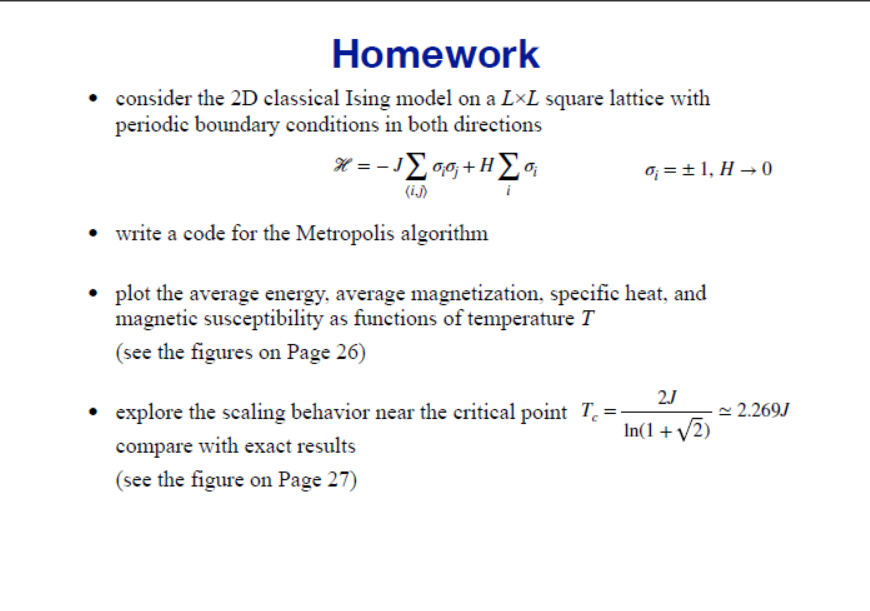
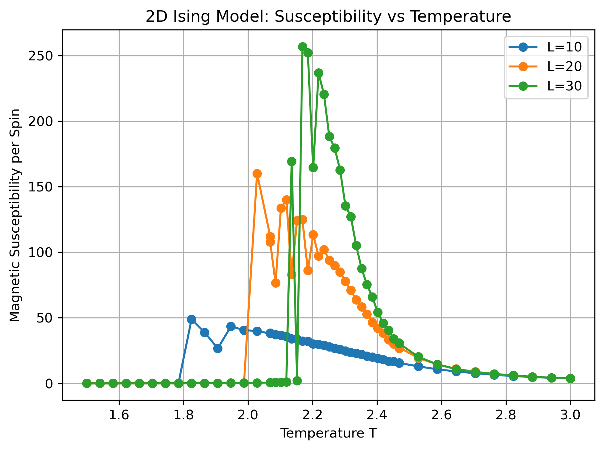
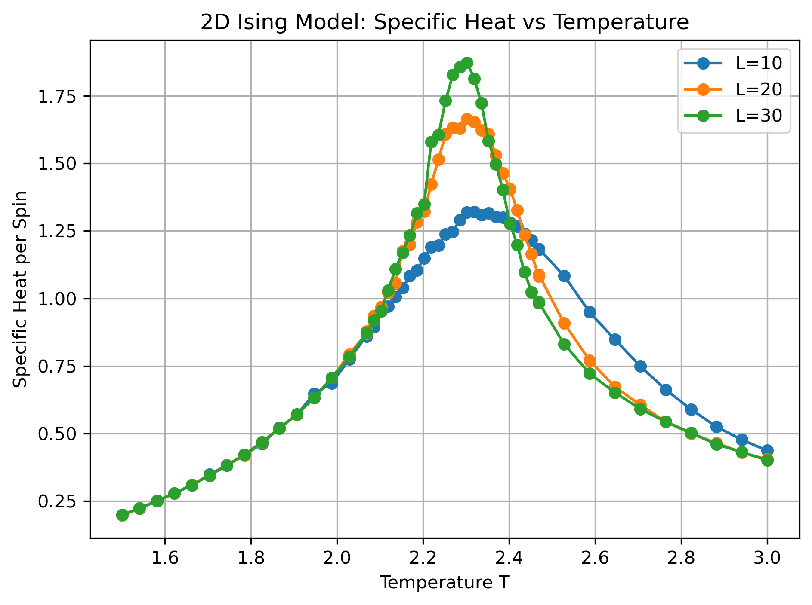
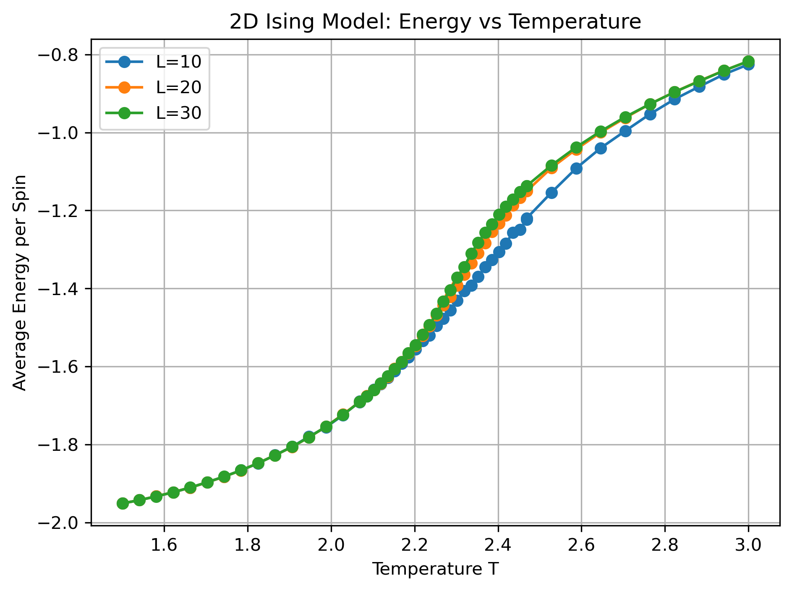
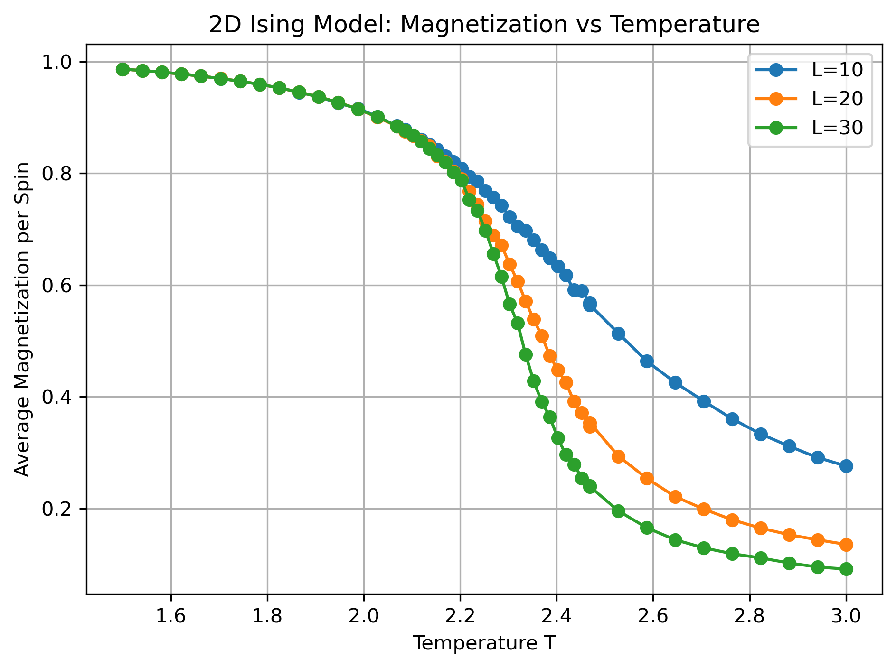
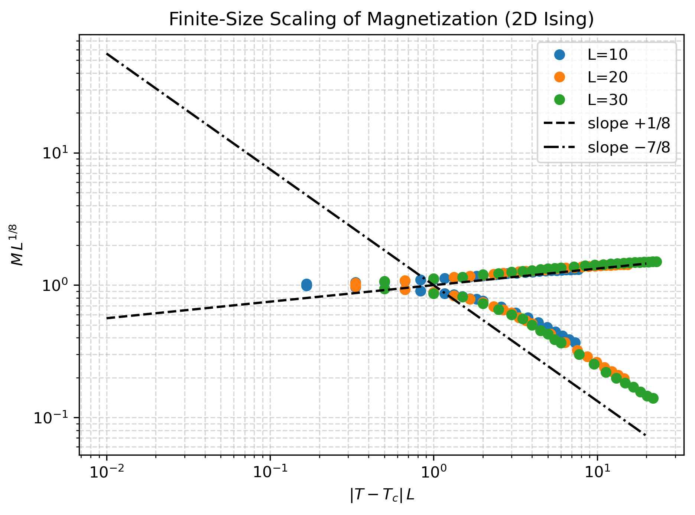

这次作业文件夹中的python脚本2D_Ising_Model_Monte_carlo.py包含了课程题目要求的所有代码，可以通过python3 2D_Ising_Model_Monte_carlo.py在命令行中运行，程序需要比较久的时间，但是我会对应打印正在进行的步骤，作业要求的图会画在images文件夹中。脚本中包含了画图程序和模拟程序，模拟程序打包成了函数可以被调用。我编写的模拟函数只能模拟Ising模型，如果要模拟别的模型需要修改函数中的能量的定义。

在编写程序过程中，我遇到了处理周期性边界条件的问题，最后被很轻松地解决了。除此之外，我遇到了1.程序整体耗时较长2.低温区域收敛性差3.临界点附近性质不清晰的问题。为了简单起见，我的蒙特卡洛算法使用了固定步数。为了解决2的问题，我认为可以编写一个误差函数，通过整体能量的偏差来判断是否收敛自适应调整步数，但是在我的程序中我没有使用。3的问题尤其体现在对磁化率的测量上，这是算法的问题，在固定步数时在临界点附近很容易出现热化不完全导致磁导率测量出现问题，为此我提高了热化的过程的步数，但是问题没有被解决。未来可能可以从算法层面做出修改。关于1的问题我使用了随温度变化的步数，在温度高时测量和平衡的步数都比较小，在温度低时增大步数。在编程中我发现其实是python自带的for循环的速度太慢了，所以我只能采用了njit来加速循环，效果非常显著。

我的程序采用了简单的Metropolis algorithm，我编写了一个函数进行一次Metropolis过程，然后先演化系统一段时间使其达到热平衡，随后再进行测量，在一次测量中将所有的物理量全部测量完成以节约时间。具体的函数可以看脚本中的注释。

关于问题的回答
(1)

(1)

(1)

(1)

(2)
